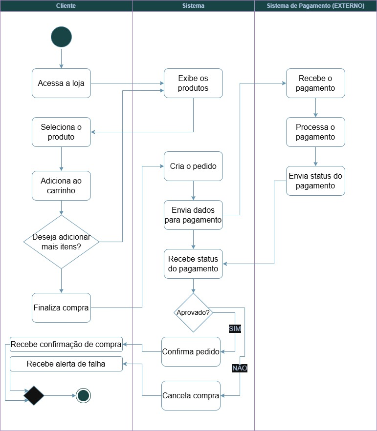
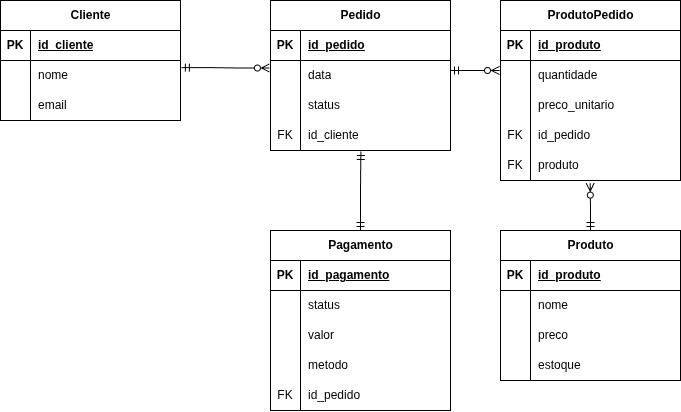

# Lojinha Singleton

Simulação de uma lojinha online desenvolvida em Java, seguindo arquitetura 
cliente-servidor monolítica, utilizando programação orientada a objetos pura, 
sem frameworks externos, interface gráfica ou banco de dados.

---

## Estrutura do Projeto
```
Lojinha-Singleton/
└── src/
    └── lojinha/
        ├── model/
        │   ├── Cliente.java
        │   ├── Produto.java
        │   ├── Pedido.java
        │   ├── ItemPedido.java
        │   └── StatusPedido.java
        ├── repository/
        │   ├── ClienteRepository.java
        │   └── ProdutoRepository.java
        ├── service/
        │   ├── ClienteService.java
        │   ├── ProdutoService.java
        │   └── PedidoService.java
        ├── payment/
        │   ├── ConexaoPagamentoSingleton.java
        │   └── ResultadoPagamento.java
        ├── exception/
        │   └── ClienteNaoEncontradoException.java
        ├── LojinhaServidor.java
        └── simulation/
            └── Main.java
```

---

## Como Executar

**Pré-requisitos**
- Java 11 ou superior instalado
- IntelliJ IDEA

**Passos**
1. Clone o repositório
```bash
   git clone https://github.com/Hufevas/Lojinha-Singleton.git
```
2. Abra o projeto no IntelliJ IDEA
   - `File` → `Open` → selecione a pasta do projeto
3. Aguarde o IntelliJ indexar os arquivos
4. Localize a classe `lojinha.simulation.Main`
5. Clique com botão direito → `Run 'Main'`

---

## Principais Decisões Arquiteturais

### 1. Arquitetura Cliente-Servidor Monolítica
Todas as responsabilidades do backend estão concentradas em uma única 
aplicação — a classe `LojinhaServidor` — que centraliza e expõe os 
serviços para a simulação. Não há separação em microsserviços ou módulos 
independentes.

### 2. Arquitetura em Camadas
O sistema foi organizado em camadas com responsabilidades bem definidas:

- **Model**: entidades do domínio (Cliente, Produto, Pedido, ItemPedido, StatusPedido)
- **Repository**: gerencia os dados em memória com registros estáticos
- **Service**: implementa a lógica de negócio da aplicação
- **Payment**: camada separada para comunicação com o serviço de pagamento (Singleton)
- **Exception**: tratamento de erros customizados

### 3. Dados Estáticos em Memória
Todos os dados são armazenados estaticamente nos repositórios:
- `ClienteRepository`: 3 clientes pré-cadastrados
- `ProdutoRepository`: 5 produtos pré-cadastrados

### 4. Orientação a Objetos Pura
O sistema utiliza apenas recursos nativos do Java, sem frameworks externos:
- Encapsulamento com getters e setters
- Relacionamentos entre objetos
- Coleções nativas (List, ArrayList)
- Enum para controle de status do pedido

### 5. Validação de Estoque
O `PedidoService` valida a disponibilidade de estoque antes de criar um 
pedido, garantindo que não sejam processados itens indisponíveis.

### 6. Simulação de Pagamento
O sistema simula o processamento de pagamento com:
- 80% de chance de aprovação
- 20% de chance de recusa
- Atualização automática do status do pedido conforme o resultado

---

## Padrão Singleton — ConexaoPagamentoSingleton

### Onde foi aplicado
O padrão Singleton foi implementado na classe `ConexaoPagamentoSingleton`, 
localizada em:
```
src/lojinha/payment/ConexaoPagamentoSingleton.java
```

### Como funciona
```java
public class ConexaoPagamentoSingleton {

    private static volatile ConexaoPagamentoSingleton instancia;

    // Construtor privado - impede instanciação externa
    private ConexaoPagamentoSingleton() { }

    // Método de acesso único à instância (double-checked locking)
    public static ConexaoPagamentoSingleton getInstancia() {
        if (instancia == null) {
            synchronized (ConexaoPagamentoSingleton.class) {
                if (instancia == null) {
                    instancia = new ConexaoPagamentoSingleton();
                }
            }
        }
        return instancia;
    }
}
```

### Justificativa
A conexão com o sistema externo de pagamento é implementada como Singleton 
porque representa um recurso compartilhado. Em produção, essa conexão 
envolveria autenticação com credenciais, canal seguro (TLS/HTTPS) e controle 
de rate-limit. Criar múltiplas instâncias poderia causar:
- Conflitos de sessão
- Duplicidade de transações
- Desperdício de recursos

O Singleton garante que exista **um único ponto de comunicação** com o 
serviço de pagamento durante toda a execução do sistema.

### Demonstração no Main
O `Main.java` demonstra que o Singleton está funcionando corretamente:
```java
ConexaoPagamentoSingleton instancia1 = ConexaoPagamentoSingleton.getInstancia();
ConexaoPagamentoSingleton instancia2 = ConexaoPagamentoSingleton.getInstancia();
System.out.println(instancia1 == instancia2); // Retorna true
```

---

## Cenários Simulados

### Cenário 1 — Alice Souza
- Identifica a cliente pelo ID
- Exibe o catálogo de produtos
- Adiciona ao carrinho: 1x Teclado Mecânico, 2x Mouse Gamer
- Cria o pedido e valida estoque
- Processa o pagamento via gateway externo
- Exibe resultado (aprovado ou cancelado)

### Cenário 2 — Bruno Lima
- Identifica o cliente pelo ID
- Exibe o catálogo de produtos
- Adiciona ao carrinho: 1x Monitor 24"
- Cria o pedido e valida estoque
- Processa o pagamento via gateway externo
- Exibe resultado (aprovado ou cancelado)

### Verificação do Singleton
```
Instância 1 hash: 1751075886
Instância 2 hash: 1751075886
São a mesma instância? true
```

---

## Fluxo de Execução
```
1. Identificar cliente → 2. Exibir produtos → 3. Adicionar ao carrinho →
4. Validar estoque → 5. Criar pedido → 6. Processar pagamento →
   → Se APROVADO: Confirmar pedido → Notificar cliente
   → Se RECUSADO: Cancelar pedido  → Alertar cliente
```

---

## Diagrama de Atividades



---

## Diagrama Entidade-Relacionamento



---

## Requisitos Técnicos Atendidos

- ✓ Linguagem: Java 11+
- ✓ Sem frameworks externos
- ✓ Sem banco de dados (dados em memória)
- ✓ Paradigma: Orientação a Objetos pura
- ✓ Logs descritivos no console
- ✓ Singleton com double-checked locking e volatile
- ✓ Estrutura de pacotes organizada por responsabilidade
- ✓ Repositórios com dados estáticos pré-cadastrados
- ✓ Serviços com lógica de negócio separada
- ✓ Simulação de 2 cenários completos de compra

---

## Observações

- O sistema é uma simulação educacional e não deve ser utilizado em produção
- Os pagamentos são simulados aleatoriamente (80% aprovado, 20% recusado)
- Não há persistência de dados — ao encerrar o programa, todos os dados são perdidos
